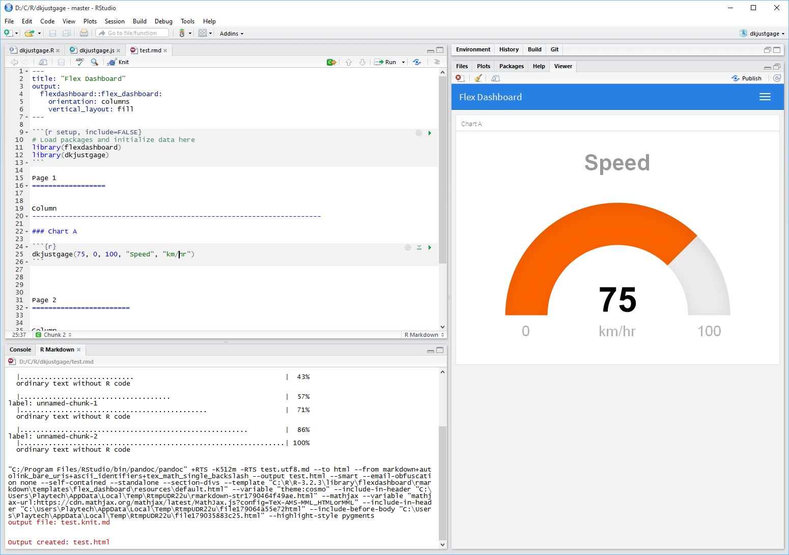

# dkjustgage

R HTMLWidget for [justgage](https://github.com/toorshia/justgage)

## Example



## Features

- Hack to retrigger justgage animation on Flexdashboard tab pane change
- Custom sectors for below/above target

## Installation

```r
library(devtools)
install_github("dkilfoyle/dkjustgage")
```

## Usage

### Gradient fill

```r
library(dkjustgage)
dkjustgage(value=75, min=0, max=100, title="Speed", label="km/hr")
```

### Red/Green Traffic light

```r
library(dkjustgage)
dkjustgage(value=30, min=0, max=100, title="Production", label="Target=70", target=70)
```
